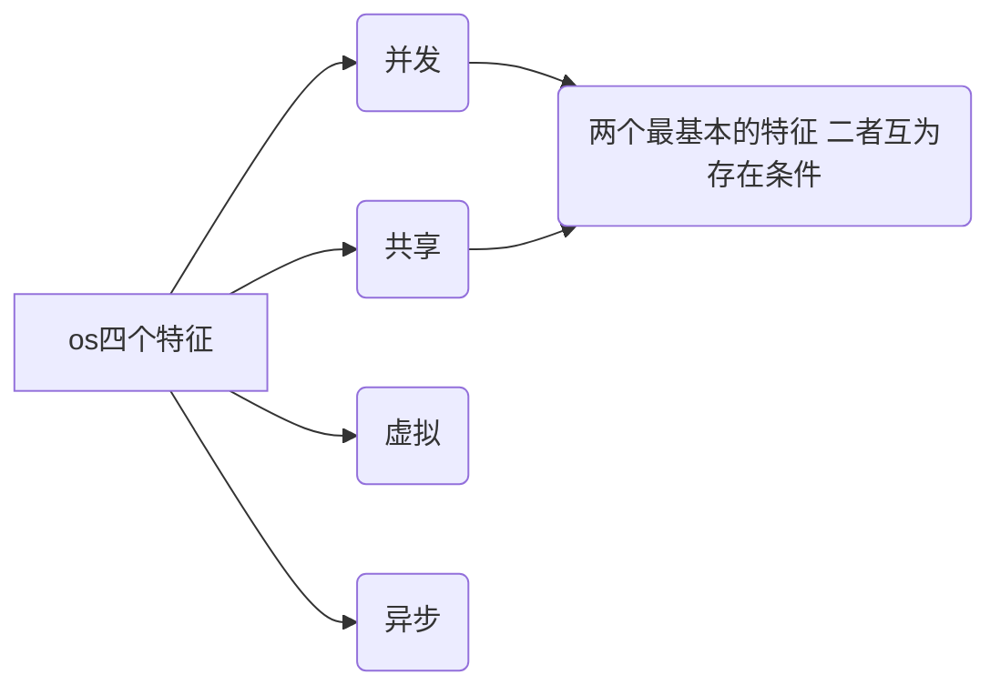
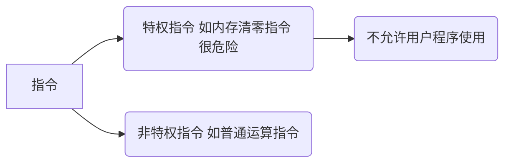
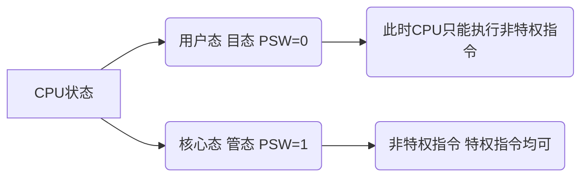

## 1. 操作系统的概念、功能和目标

### 概念


操作系统位于软件（应用程序）和裸机（纯硬件，如CPU、内存、硬盘）之间，但也可和用户交互。
操作系统是指控制和管理整个计算机系统的硬件和软件资源，并合理地组织调度计算机的工作和资源分配，以提供给用户和其他软件方便的接口和环境，它是计算机系统最基本的`系统软件`。

### 功能和目标

* 作为系统功能的管理者
  

进程：一个程序的执行过程，执行前需将该程序放到内存中，才能被CPU处理。


以使用QQ为例：

1. 在文件夹中找到QQ.exe的位置：文件管理
2. 双击QQ.exe，把进程放到内存：存储器管理
3. QQ运行，对应进程被处理机（CPU）处理：处理机管理
4. 和朋友视频，把摄像头设备分配给进程：设备管理

* 作为用户和计算机硬件之间的接口：方便用户使用
  
    ```mermaid
        graph LR
        用户接口-->A(命令接口:用户直接使用)
        A-->D(联机命令接口 用户说一句系统做一句 交互式 如cmd)
        A-->E(脱机命令接口 用户说一堆系统做一堆 批处理 如bat文件)
    
        用户接口-->B(程序接口:用户通过程序间接使用 由一组系统调用组成 )
        B-->F(注意:程序接口=系统调用=系统调用指令=广义指令)
      用户接口-->C(GUI接口 图形用户界面)
      
  ```
  
* 作为最接近硬件的层次

    

### 总结  


## 2. 操作系统的特征



没有并发和共享，就谈不上虚拟和异步。

### 并发

指两个或多个事件在``同一时间间隔``内发生，宏观上同时发生，微观上交替发生。

cf：并行，在``同一时刻``发生。

操作系统中同时存在着多个运行着的程序。

### 共享

资源共享，系统中的资源可供内存中多个并发执行的进程共同使用。

* 互斥共享：一个时间段内只允许一个进程访问该资源。比如微信QQ视频时的摄像头。

* 同时共享：一个时间段内允许多个进程“同时”访问该资源（这里的同时往往是宏观上的，微观上分时共享）。比如QQ发送文件A，微信发送文件B，实际上交替访问硬盘。

### 虚拟

* 虚拟技术中的"空分复用技术"
  
    例如电脑只有4GB内存，但它同时使用着的程序需要的内存之和大于4GB，电脑仍然可以正常使用。

* 虚拟技术中的"时分复用技术"
  
    例如单核CPU电脑可以同时运行多个程序

### 异步

在多道程序环境下，多个程序并发执行，但由于资源有限，进程的执行不是一贯到底，而是走走停停。

## 3. 操作系统的发展与分类


### 手工
  
缺点，用户独占全机，人的速度慢，资源利用率低

### 单道批处理
  
引入脱机输入输出技术，并`监督程序`（操作系统的雏形，速度快）控制作业的输入输出，资源利用率提高

缺点：只有一道程序运行，CPU有大量的时间是在等待IO完成。

### 多道批处理

每次往内存中输入多道程序，操作系统正式诞生。并发执行，共享计算机资源，资源利用率提升。

缺点：用户响应时间长，没有人机交互功能，用户不能控制作业执行。

我觉得它像流水线。


### 分时操作系统

计算机以`时间片`为单位`轮流`为各个用户/作业服务，各个用户可以通过终端与计算机交互。

优点:用户请求可以被即时响应，解决了人机交互问题。允许多个用户同时使用一台计算机，并且用户对计算机的操作相互独立，感受不到别人的存在。

缺点：`不能优先处理一些紧急任务`。操作系统对各个用户/作业都是完全公平的，循环地为每个用户/作业服务一个时间片，不区分任务的紧急性。

### 实时操作系统
  
能够优先响应一些紧急任务，某些紧急任务不需时间片排队。
    
在实时操作系统的控制下，计算机系统接收到外部信号后及时进行处理，并且要`在严格的时限内处理完事件`。实时操作系统的主要特点是`及时性和可靠性`。

* 硬实时系统
  
    必须在绝对严格的时间内完成处理

* 软实时系统
    
    能接受偶尔违反时间规定

### 其他

了解即可，考研主要考上面几种

* 网络操作系统
  
  是伴随着计算机网络的发展而诞生的，能把网络中各个计算机有机地结合起来，实现数据传送等功能，实现网络中各种资源的共享(如文件共享)和各台计算机之间的通信。

  如: Windows NT就是一种典型的网络操作系统，网站服务器就可以使用。

* 分布式操作系统
  
  主要特点是分布性和并行性。

  系统中的各台计算机地位相同，任何工作都可以分布在这些计算机上，由它们并行、协同完成这个任务。

* PC操作系统
  
  win10 ubuntu MacOS

### 总结


## 4. 操作系统的运行机制与体系结构

### 两种（指令、处理器状态、程序）



——CPU怎么判断当前是否可以执行特权指令？

——根据当前处理器状态（用户态、核心态）

程序状态寄存器PSW中的某个标志位来标识状态。


* 两种程序

    应用程序，为了安全，运行在用户态。

    内核程序，系统管理者，运行在核心态。

### 内核

内核是计算机最底层的软件，是操作系统最核心的部分。实现操作系统内核功能的程序才是内核程序。


原语，运行时间短，调用频繁，原子性运行只能一气呵成，不可中断。

不同os对内核的划分不太一样。有些操作系统不把对系统资源进行管理的功能（上图深橘色部分）归为内核功能。由此引出操作系统的体系结构问题。

### 体系结构

* 大内核 上图深橘色一行+橙色一行
    <br>将操作系统的主要功能模块都作为系统内核
    <br>优点：高性能
    <br>缺点：内核代码庞大，结构混乱，难以维护

* 微内核 上图橙色一行
    <br>只把基本概念保留在内核
    <br>优点：功能少，功能清晰，方便维护
    <br>缺点：需要频繁的在核心态和用户态之间切换，性能低

### 总结


## 5. 中断和异常

### 中断的概念

中断的本质：发生了中断，就意味着需要操作系统介入，开展管理工作。

1. 中断发生时，CPU立即进入`核心态`
2. 中断发生后，当前运行的进程暂停运行，并由操作系统对中断进行处理
3. 对于不同的中断信号，会进行不同的处理

​由于操作系统的管理工作(比如进程切换、分配I/O设备等)需要使用特权指令，因此CPU要从用户态转为核心态。
​**中断可以使CPU从用户态切换为核心态，使操作系统获得计算机的控制权**。有了中断才能实现多道程序并发执行。

**中断是CPU从用户态->核心态切换的唯一途径。** 核心态到用户态切换只需要执行一个特权指令，将程序状态字PSW的标志位设置为用户态。

### 中断的分类

- 一种分类方式
  
- 另一种分类方式


### 外中断的处理

类似游戏存档。

- 执行完每个指令之后，CPU都要检查当前是否有外部中断信号
- 如果检测到外部中断信号，则需要保护被中断进程的CPU环境(如程序状态字Psw、程序计数器PC、各种通用寄存器)
- 根据中断信号类型转入相应的中断处理程序(进入核心态)
- 恢复原进程的CPU环境并退出中断，返回原进程继续往下执行
  
### 总结


## 6. 系统调用

### 什么是系统调用

操作系统作为用户和计算机硬件之间的接口，需要向上提供一些简单易用的服务。主要包括命令接口和程序接口。


`系统调用`是操作系统**提供给应用程序**(程序员/编程人员)使用的接口，可以理解为一种可供应用程序调用的特殊函数，应用程序可以发出系统调用请求来获得操作系统的服务。

——为什么要设置“系统调用”功能？

——**应用程序通过系统调用请求操作系统的服务。** 系统中的各种共享资源都由操作系统统一掌管，因此在用户程序中，凡是与资源有关的操作(如存储分配、I/O操作、文件管理等) ，都必须通过系统调用的方式向操作系统提出服务请求,由操作系统代为完成。**这样可以保证系统的稳定性和安全性，防止用户进行非法操作。**


### 系统调用和库函数的区别


- 系统调用是操作系统向上提供的接口
- 有的库函数是对于系统调用的进一步封装
- 大多数高级语言提供的库函数间接进行系统调用
  
### 系统调用背后的过程


### 总结


> thanks for [B站王道计算机教育](https://www.bilibili.com/video/BV1YE411D7nH?p=8&spm_id_from=pageDriver&vd_source=38881132948112534788036151fc388f)

