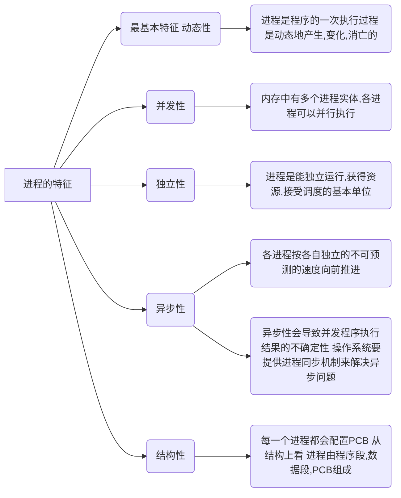

<h2> 1.进程的基本内容 </h2>
<h3>定义</h3>

程序就是一个指令序列。早期计算机只支持**单道**程序，CPU和内存、IO设备等系统资源都只为这个程序服务。程序的代码放在程序段内，程序运行过程中处理的数据放在数据段内，中间数据，如变量。这些数据可以存在内存中的某个位置。

引入**多道**程序后，内存中存放多道程序，各个程序的代码、中间数据存放的位置不同。为方便操作系统管理，引入进程、进程实体的概念。

**程序段、数据段、PCB三部分组成了进程实体(进程映像) 。**一般情况下，我们把进程实体就简称为进程。例如，所谓创建进程，实质上是创建进程实体中的PCB；而撤销进程，实质上是撤销进程实体中的PCB。

**注意: PCB是进程存在的唯一标志!**

从不同的角度，进程可以有不同的定义，比较传统典型的定义有以下三种:
>强调动态性

​1. 进程是程序的一次执行过程。 
​2. 进程是一个程序及其数据在处理机上顺序执行时所发生的活动。 
​3. 进程是具有独立功能的程序在数据集合上运行的过程，它是系统进行资源分配和调度的一个独立单位。 

​引入进程实体的概念后，可把进程定义为**进程是进程实体的运行过程，是系统进行资源分配和调度的一个独立单位。**

注：严格来说，进程实体和进程并不一样，进程实体是静态的，进程则是动态的。不过，除非题目专门考察二者区别，否则可以认为进程实体就是进程。因此我们也可以说“进程由程序段、数据段、PCB三部分组成”。

<h3>组成</h3>

- 程序段，存放程序代码本身。

- 数据段，存放程序运行过程中使用、产生的运算数据。如全局变量、局部变量宏定义的常量等。
- PCB，操作系统对进程管理所需的数据。

    

<h3>组织方式</h3>

一个系统里面通常由数千个PCB，为了更有效地管理，需要用适当的方式把他们组织起来。

* 进程的组织：链接方式
   按照进程状态将PCB分为多个`队列`，操作系统持有指向各个队列的指针。 
  

* 进程的组织：索引方式
     根据进程状态不同，建立几张`索引表`。操作系统持有指向各索引表的指针。 
     

<h3>特征</h3>

<h3>总结</h3>

<h2> 2.进程的状态与转换</h2>
<h3>三种基本状态</h3>

- **运行态（Running）占有CPU，并在CPU上运行**。单核处理器一个时刻最多只有一个进程处于运行态，双核环境下可以同时有两个程序处于运行态。
- **就绪态（Ready）**进程已经具备一切运行条件，除了没有空闲CPU，导致暂时不能运行。**万事俱备，只差CPU。**一旦获得CPU，即可立即进入运行态。
- **阻塞态（也叫等待态，Waiting/Blocked）等待某一事件而暂时不能运行，**比如等待操作系统分配打印机、等待磁盘读写。CPU是计算机中最昂贵的部件，为了提高CPU利用效率，进程需要先准备好其它所需资源，才能得到CPU的服务。

另外两种状态（创建态New，终止态Terminated）。创建态是指操作系统为该进程分配所需内存等系统资源，为其创建、初始化PCB(分配PID等等)。终止态指进程运行结束，或者出现Bug导致无法继续执行，操作系统需要撤销进程，完成资源回收，撤销PCB​。
<h3>进程状态的转换</h3>

<h3>总结</h3>

<h2> 3.进程控制</h2>

进程控制的主要功能是**对系统中的所有进程实施有效的管理**，它具有创建新进程、撤销已有进程、实现进程状态转换等功能。**简而言之就是实现进程状态切换。**  
用原语实现进程控制，原子操作，**执行期间不允许中断**。原语采用**关中断指令**和**开中断指令**实现。开关中断指令权限很大，只能在核心态下执行。原语是OS内核的一部分，运行在核心态。

无论哪个原语，要做的无非三类事情:  
1. **更新PCB中的信息** (如修改进程状态标志、将运行环境保存到PCB、从PCB恢复运行环境)  
   a.所有的进程控制原语一定都会修改进程状态标志  
   b.剥夺当前运行进程的CPU使用权必然需要保存其运行环境  
   c.某进程开始运行前必然要恢复其运行环境  
2. **将PCB插入合适的队列**  
3. **分配/回收资源**
   
<h3>进程创建</h3>

<h3>进程终止</h3>

<h3>进程的阻塞、唤醒</h3>
运行态--阻塞态--就绪态

<h3>进程切换</h3>
运行态--阻塞态/就绪态 就绪态--运行态

<h3>总结</h3>

<h2> 4.进程通信</h2>

进程通信就是进程之间的信息交换。**各进程应用各自的内存地址空间，它们相互独立。**为了保证安全，**一个进程不能直接访问另一个进程的地址空间。**但是进程之间的信息交换又是必须实现的。

<h3>共享存储</h3>

<h3>管道通信</h3>

<h3>消息传递</h3>

<h3>总结</h3>

> thanks for [B站王道计算机教育](https://www.bilibili.com/video/BV1YE411D7nH?p=8&spm_id_from=pageDriver&vd_source=38881132948112534788036151fc388f)
