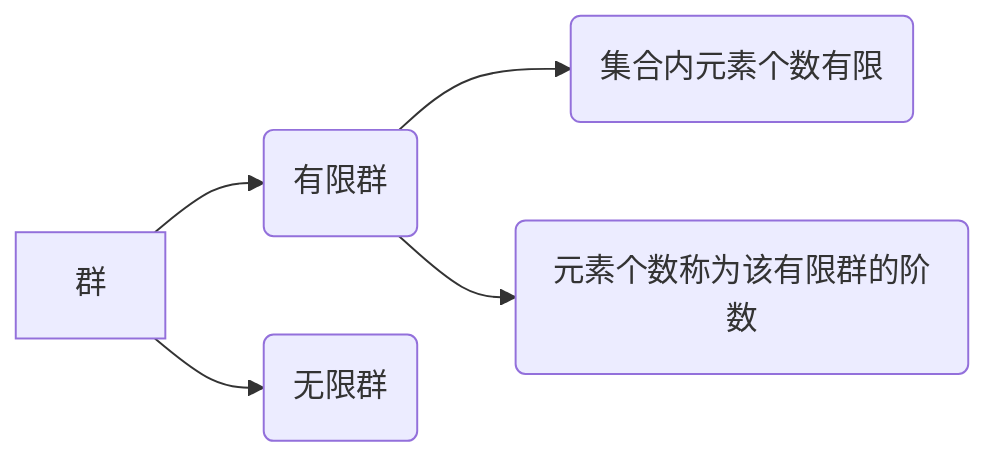

> 《离散数学》左孝凌 郭永才
{: .prompt-info }

## 1. 引入

> 由集合A的所有子集组成的集合，称为A的幂集，记作$2^{A}$或$P(A)$， 即 $2^{A} = {S | S ⊆ A}$．    
> GCD函数，返回两个或多个整数的最大公约数。LCM函数，返回整数参数的最小公倍数。   
> I，整数集合。

**封闭**，对于集合 $A$，一个从 $A^{n}$ 到 $B$ 的映射，称为集合 $A$ 上的一个n元运算，如果 $B\subseteq A$ ，则称该n元运算是封闭的。

**代数系统**，一个非空集合 $A$ 连同若干个定义在该集合上的运算 $f_{1}, f_{2}, ..., f_{k}$ 所组成的系统称为一个代数系统,记作 $<A, f_{1}, f_{2}, ..., f_{k}>$ 。

>代数系统 = 非空集合 + 运算

## 2. 运算及其性质   
>讨论的是二元运算   

* 封闭    
* 可交换    
* 可结合   
* 可分配   
  运算 $@$ 对运算 $?$ 是可分配的，则 $a @ (b?c) = (a@b) ? (a@c)，(b?c) @ a = (b@a) ? (c@a)$    
  先跟括号里的数进行 $@$ 运算，最后再进行 $?$ 运算。
* 吸收律   

* 等幂   

* 幺元  
    >幺元无论跟什么数运算，结果都是那个数

* 零元     
  >零元无论跟什么数运算，结果都是零元

* 逆元    
  逆元是唯一的。
  
## 3. 群   

|代数系统|性质|
|---|---|
|广群|封闭|
|半群|封闭、可结合|
|独异点|封闭、可结合、有幺元|
|群|封闭、可结合、有幺元、每个元素都有逆元|
 
* 独异点的运算表中任何两行任何两列都是不相同的。    
* 独异点，运算？，任意两个元素a、b，都有逆元，则$(a^{-1})^{-1} = a, (a?b)^{-1} = b^{-1}?a^{-1}$    

* 子群    
* 平凡子群，G是群，B={e}或者B=G。

## 4. 阿贝尔群和循环群     
* 群中运算是可交换的，就叫阿贝尔群（交换群）。   
* 群中元素a，使得G中元素都由a的幂生成，就称为循环群，a是生成元。

## 5. 环与域   

 
